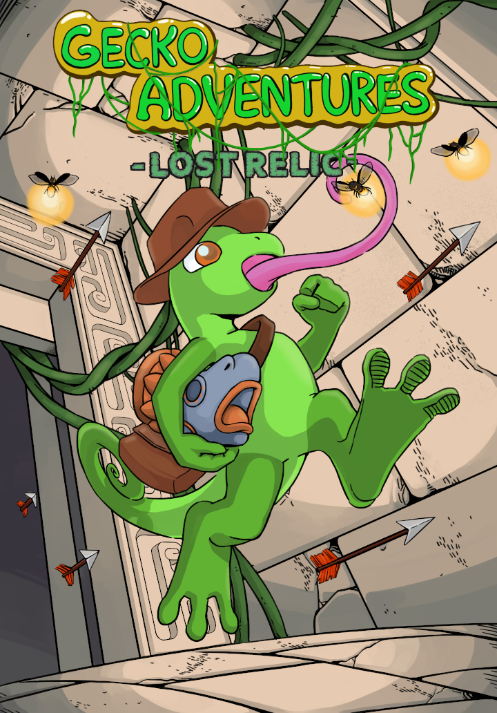

# Gecko Adventures - Lost Relic

This game was developed within the project "Indiegame Development Lab II" at the Bauhaus-University Weimar in 2022.

Contributors:
- Aaron Kammer (programmer)  
- Jenny Döring (programmer)  
- Ulrike Katzschmann (artist)  
- Olga Molzan (artist)

## Description

This 2D pixel platformer is about a gecko adventurer who wants to recover an artifact from long forgotten times.
On his expedition he explores the depths of an ancient temple ruin full of deadly traps. Fortunately, his tongue is the best tool to shimmy through dangerous parkours and puzzles.

## Installation

The project is implemented in Unity 2021.3.0f1